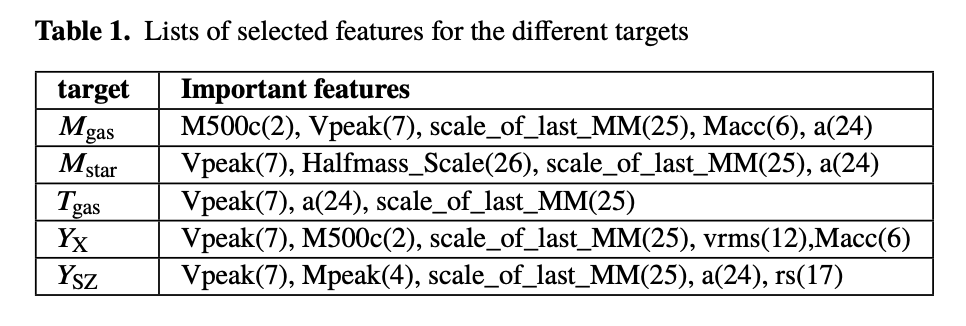

# DarkML
Use of Machine Learning for finding a mapping between Rockstar cluster-size halo catalogues from dark-matter-only  and hydrodinamic simulations. We have populated 3  dark matter only halo catalogues with  baryon properties from two different simulations: the Multidark Planck simualtion (MDPL2)  box_size=1 Gpc h^{-1} and the UNIT simulation box_size = 1Gpc h^{-1}  with 2048^{3} (UNITSIM2048) and 4096^{3} (UNITSIM4096) particles. We have uploaded csv files containing the generated data and also the trained XGBoost model for the user's convenience. 
## Dependences
* [XGBoost](https://xgboost.readthedocs.io/en/stable/) 
* [scikit-learn](https://xgboost.readthedocs.io/en/stable/)
* [pandas](https://pandas.pydata.org/)

## Cluster-size halo catalogues with Baryon properties
We have generated dark matter halos with baryon properties for the three DM-only simulations listed above. Below, we provide a link to download  the catalogues. 
[Files](http://taurus.ft.uam.es/TRANSFER/The300th/DARKML/)
* [MDPL2](http://taurus.ft.uam.es/TRANSFER/The300th/DARKML/MDPL2.csv)
* [UNITSIM2048](http://taurus.ft.uam.es/TRANSFER/The300th/DARKML/UNITSIM2048.csv).
* [UNITSIM4096](http://taurus.ft.uam.es/TRANSFER/The300th/DARKML/UNITSIM4096.csv)

To read the data products you can use pandas: `pandas.read_csv(file_path)`. We provide the 5 baryonic predicted properties. Note that the logarithmic value is used for the properties. For more information, we refer to the paper [link](in progress)


## Generate your own cluster  catalog from another dark matter simulation
We have created a function in Python  that reads a file containing a list of the most relevant features extracted from Rockstart halo catalogues and predicts the baryon properties. The function reads the save models in the desired `model_path` and the data frame containing all the DM-only properties listed in the file `feature_file`  and predicts the properties for all the targets inside `feature_file`. The predictions is the average of the 10 models considered in the 10K-fold cross-validation.

 

```
import numpy as np
import sys
import os
import pickle
import json

def xgb_pred(target,df):
    
    with open(feature_file, 'r') as fp:
        final_features = json.load(fp)
    preds = []
    
    for kfold in range(10):
        model_file = model_path + 'redXGBkfolds_{}/models/model_kfold{}.sav'.format(target,kfold)
        model = pickle.load(open(model_file, 'rb'))
        features = final_features[target]
        preds.append(model.predict(df[features].values))

    pred = np.array(preds).mean(axis=0)
    
    return pred
```
